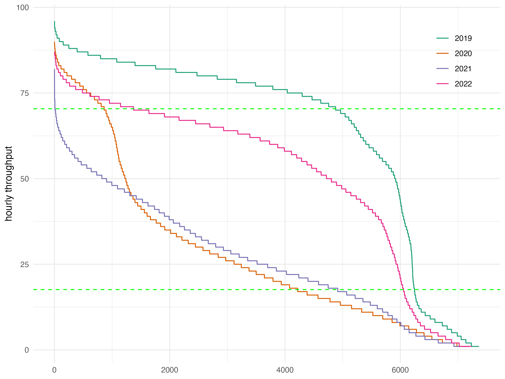

```{r, echo=FALSE}
#| label: setup
#| echo: false
#| message: false
source(here::here("_chapter-setup.R"))
source(here::here("R","05-capacity_and_throughput-graphs.R"))
```


# Capacity and Throughput

Maintaining an optimal network flow necessitates a equilibrium between airport capacity and flight demand.
This section delves into assessing capacity and throughput using various key performance indicators (KPIs) at the airport level.
Airspace users expect sufficient capacity provision addressing the levels of demand.
With higher levels of capacity utilisation, airspace users will experience congestion and constraints (e.g. higher inefficiency, increased delay/lower punctuality and predictability).
However, planning and staffing for peak situations may come at significant costs to airspace user as well.
In that respect it is essential to understand the trade-off between capacity provision and capacity consumption (i.e. traffic demand) as it impacts the overall system performance.
Capacity and throughput analyses are therefore showing to what extent air navigation services are capable to accommodate the demand.
The previous sections showed the level of overall traffic recovery in both regions.
The increasing demand put strain on the systems and local knock-on effects amplified the uncertainty and variability of the expected traffic levels.
This chapter may therefore also highlight the flexibility of air navigation services to accommodate such distortions of the schedule.

## Peak Declared Capacity

Peak Declared Capacity refers to the highest movement rate (arrivals and landings) at an airport using the most favourable runway configuration under optimal conditions.
The capacity value might be subject to local or national decision-making processes.
The indicator represents the highest number of landings an airport can accept in a one-hour period.

In both regions, peak capacity is declared by the respective authority.
In Brazil, this function is performed by DECEA.
Within the European region, the airport peak capacity is determined on a local or national level.
The processes consider local operational constraints (e.g. political caps, noise quota and abatement procedures) and infrastructure related limitations (e.g. apron/stand availability, passenger facilities).

@fig-capsovertime shows the evolution of the declared capacity for the airport services in this comparison report.
Throughout the last years, no substantial change in the peak declared capacity was observed at European airports.
In Brazil, on the other hand, 2019 and 2020 showed a revised capacity declaration at most of the Brazilian airports.
In 2018 CGNA had developed a refined method for the determination of the runway system capacity.

```{r}
#| label: fig-capsovertime
#| fig.cap: Evolution of Declared Capacities at study airports.
#| fig-height: 7


# Parâmetros gerais
lb <- 2019
ub <- 2024
lab_size <- 7

bra_cap <- bra_cap2 |> filter(APT_ICAO %in% bra_apts) 
eur_cap <- eur_cap2 |> filter(APT_ICAO %in% eur_apts)

# Geração dos gráficos
p1 <- bra_cap  |> peak_cap_plot(bra_apts_names, lb, ub, lab_size)
p2 <- eur_cap  |> peak_cap_plot(eur_apts_names, lb, ub, lab_size)

# Combinação dos gráficos
p1 | p2 & theme(plot.subtitle = element_text(size = 8))
```

The capacity of airports (and the associated runway system) is predominantly influenced by their infrastructure.
The existence of independent parallel runways, e.g. Brasilia (SBBR) and Munich (EDDM), can support decisively the resulting capacity.
Furthermore, operational procedures can lead to increased in airport capacity.
London Heathrow (EGLL), in the past, and Guarulhos (SBGR) in recent years show that changes in operational procedures can help the airport absorb significant traffic increases or reduce the additional sequencing time in the terminal airspace.
Guarulhos, for example, benefited from the implementation of segregated operations under VMC conditions, and Heathrow increased its capacity through the introduction of time-based separation on final.

In this context, @fig-peak-declared-cpacity shows the declared peak capacity for the study airports.
As observable in the case of Amsterdam Schiphol (EHAM, 6 runways), the number of runways is not a direct indication of the maximum capacity.
For example, the two-runway airports Brasilia (SBBR), London Heathrow (EGLL), and Munich (EDDM) share a similar runway system layout and range above the 3-runway systems of Barcelona (LEBL) and Zurich (LSZH).
London Gatwick (EGKK) is renown for its maximisation of its single-runway throughput.
Please note that Lisbon (LPPT) was added to this comparison report and capacity values for earlier years were not available at the time of writing.

As mentioned above, the capacity declaration/determination process takes into account the varying local conditions and constraints.
It balances the need to accommodate growth vs policy priorities and public interests.
A potential area for further research could be a closer investigation of the operational concepts deployed and the variations of the declared capacity with the local runway system characteristics.

```{r}
#| label: fig-peak-declared-cpacity
#| fig-cap: !expr glue::glue("Peak declared capacity {this_year} [flights/hour]")

generate_capacity_plot(bra_cap, eur_cap, 2024)
```

## Peak Arrival Throughput

This comparison report uses the GANP KPI to measure the peak arrival throughput as the 95th percentile of the hourly number of landings observed at an airport [@icao-doc-9750-2019].
The measure gives an indication of the achievable landing rates during "busy-hours".
It is an indication to what extent arrival traffic can be accommodated at an airport.
For congested airports, the throughput provides a measure of the effectively realized capacity.
Throughput is a measure of demand and therefore comprises already air traffic flow or sequencing measures applied by ATM or ATC in the en-route and terminal phase.
For non-congested airports, throughput serves as a measure of showing the level of (peak) demand at this airport.

@fig-arrival-throughput compares the observed annual peak arrival throughput at the study airports in Brazil and Europe.
On average, the busiest hour of the Brazilian airports under study did not suffer a significant reduction.
This signals that peak arrival demand remained fairly constant during the pandemic.
An increased arrival peak throughput was serviced at Brasilia (SBBR), Campinas (SBKP), Rio de Janeiro (SBRJ), and Confins (SBCF).
Services at Galeão (SBGL) observed a significant shift in the traffic pattern.
The peak arrival throughput fell sharply with the pandemic and has not yet recovered.
This overall picture is contrasted by the pandemic related drop of overall traffic at European airports.
The overall reduction resulted in significantly lower peak hours.
The recovery pattern is also visible in the peak arrival throughput behaviour.


```{r}
#| label: fig-arrival-throughput
#| fig-cap: Evolution of annual arrival throughput at study airports


arr_thru_bra_eur |> arrival_tp_plot(c(2019:2024))
```

With @fig-arrival-throughput, a further difference between both regions becomes apparent.
The peak arrival throughput represents the achieved peak service rate utilising the available arrival runway system capacity. 
On average, the peak arrival throughput is higher in Europe than in Brazil based on the available infrastructure.
It is interesting to see that arrival operations at SBGR, SBSP, and Brasilia (SBBR) range at the level of Gatwick (EGKK) and above Lisbon (LPPT).
At the same time, it offers growth potential when these airports are compared to the achievable arrival throughput at dual independent runway operations at Munich (EDDM) or even Heathrow (EGLL).

While the peak arrival throughout varied in Brazil over the past 6 years, the pattern is more homogeneous.
Larger variations are explainable with local demand changes.
However, compared to Europe, Brazil did not show the scale effects of lower air traffic demand during the pandemic phase. 
In light with the overall traffic recovery also the pressure on the arrival runway system increased at the European airports. 
Lisbon (LPPT) shows a level of variation. This suggests that even during the pandemic, operational peaks were serviced consistently at the same level.

## Peak Departure Throughput

In analogy to the previous section, @fig-departure-throughput shows the peak departure throughput.
The latter is determined as the 95th percentile of the hourly number of departures.

A similar picture emerges for the peak departure throughput in both regions.
In Brazil, Campinas , Brasilia and Santos Dumont reduced the peak departure in comparison with 2023.
Only Curitiba and Porto Alegre mantained the same level as 2023. For others brazilians, the peak departure increased.
A continual increase of the peak departure throughput is observed at SBGR exceeding in 2024 the pre-pandemic 2019 level. This suggests a concerted effort and more efficient use of the runway system for the departure phase.

The pattern in Europe is characterised by the continual air traffic revovery for the majority of the airports. 
A lesser pronounced variation is observed at Lisbon (LPPT) for which the peak departure rate remained fairly stable over the past years.  


```{r}
#| label: fig-departure-throughput
#| fig-cap: Evolution of departure throughput at study airports

departure_tp_plot(c(2019:2024))
```


## Declared Capacity and Peak Throughput


```{r}
#| label: fig-capvsthru 
#| fig-cap: Comparison of declared capacity and throughput for arrival phase.

key_year <- 2024

cap_peak_tp_plot(key_year)
```

Comparing the peak declared (arrival) capacity and throughput serviced at the differnt airports reveals a varying picture.
On average, @fig-capvsthru evidences that operations at the majority of the airports do not yet observe capacity constraints.
In many instances, the achieved throughput ranges about 10 flights per hour below the maximum declared capacity.
In 2024, a low utilisation was observed at Galeão (SBGL), Brasilia (SBBR), and Paris Charles de Gaule (LFPG).
Here the observed the spread between declared capacity and peak throughput exceeds 15 flights per hour.
It is also noteworthy, that a subset of airport services operate at their maximum declared capacity (e.g. SBGR, LSZH, EDDF).
These airports are also characterised by a combination of complexity of the aerodrome layout and operational context.
It will be interesting to study how these airports facilitate higher levels of demand.
Higher peak throughput rates than the declared capacity were observed at Amsterdam (EHAM), Congonhas (SBSP), and marginally at Lisbon (LPPT).
The offset at EHAM and SBSP suggest that declared capacity might be too conservative.
In the case of Amsterdam (EHAM) there is a political cap on the number of operations per year. This may result in a determined (and declared) hourly rate that does strictly speaking not apply to the operational peak situations. 

The analysis of the spread of the declared capacity vs achieved throughput is useful.
However, it gives not indication on how often the demand reaches the declared capacity level.
For this purpose, this report determines two characteristics points, i.e., the *BLI* base load index, and the peak load index *PLI*.

::: {layout="[55,45]"}
{#fig-bli-pli-example}

-   @fig-bli-pli-example shows the ordered set of hourly throughputs for the past years.
-   this allows to identify when the achieved total throughput ranges above characteristics levels (i.e. base load index := 20% of max capcaity, peak load index := 80% of max capacity)
:::

```{r}
#| label: fig-bli-pli
#| fig-cap: Capacity utilisation (base load index vs peak load index)

bli_pli_plot(c(2019:2024))
```

@fig-bli-pli provides an overview of the utilisation of the available capacity during the course of a year.
In Brazil, we observe a high utilisation of the capacity at Sao Paulo (SBSP) and Rio de Janeiro (SBRJ) in 2023 compared to earlier years (e.g. 2022).
However, it must be noted that both aerodromes are characterised by a relatively conservative and low capacity declaration.
The major hub in Brazil, SBGR shows a relatively high base-load-index (BLI), however rarely observed peak loads back in 2019.
The associated values for 2022 or 2023 still range below the pre-pandemic performance.
Within the European context, a high utilisation of the available system capacity was observed for London Heathrow, Frankfurt, and Gatwick in 2019 with a BLI above 0.8 and the associated PLI above 0.4 (top right quadrant).
It is noteworthy that in the European region in 2023 only London Heathrow returned to similar levels of capacity utilisation.
For the majority of European airports, the peak load index ranges relatively low.
This suggests that most of the airports operate currently concentrated short peaks or have not yet seen a return to pre-pandemic patterns.
Using a regression analysis, we can also see a difference in the trend in Europe in comparison to Brazil.
Amongst the study airports, there is a higher share of airports with a more peak operating hours than in Brazil. 
This might be related to the overall role of the airports and underlying connectivity structure and demand levels already described in earlier chapters.
Future work on understanding the drivers between operational concepts and demand may reveal further characteristics of the service provision in both systems.

## Summary


This chapter analyzed the relationship between airport capacity, throughput, and demand management across Brazilian and European airports.

On average, declared peak capacities at Brazilian airports tend to be lower than in Europe, suggesting greater flexibility to accommodate future traffic growth at major Brazilian hubs.
In contrast, many European airports will increasingly depend on novel operational concepts to achieve further gains, as their existing runway infrastructure and separation standards already impose operational limits.

Comparing the utilisation of capacity based on a new indicator revealed interesting patterns. Most airports currently operate with a margin between declared capacity and observed peak throughput, suggesting that, at present, runway system capacities are not a limiting factor in either region.

Notably, in 2024, low utilisation was observed at Galeão (SBGL), Brasília (SBBR), Rome Fiumicino (LIRF), and Paris Charles de Gaulle (LFPG), where the spread between capacity and peak throughput exceeded 15 flights per hour. Conversely, São Paulo Congonhas (SBSP) emerged as one of the most constrained facilities, servicing peak arrival rates close to or slightly above its declared capacity.

Overall, the findings highlight that while current capacities are sufficient, maintaining system performance amid projected air traffic growth will increasingly depend on operational innovations and efficient management strategies in both regions. 
