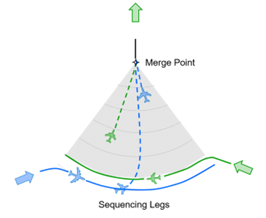
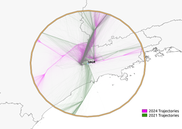
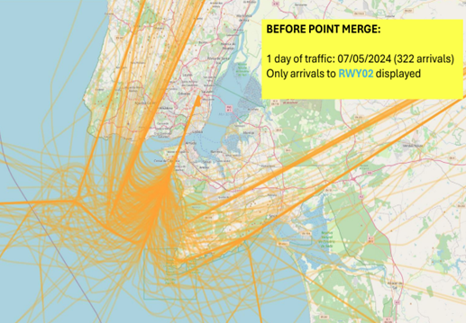
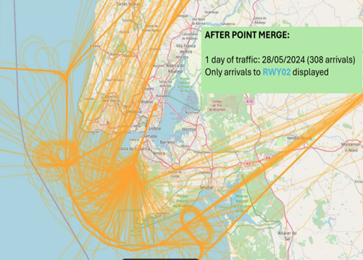
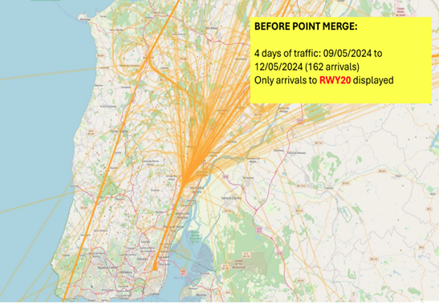
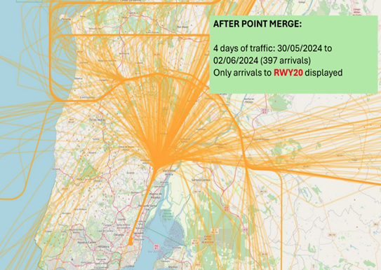
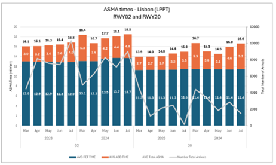
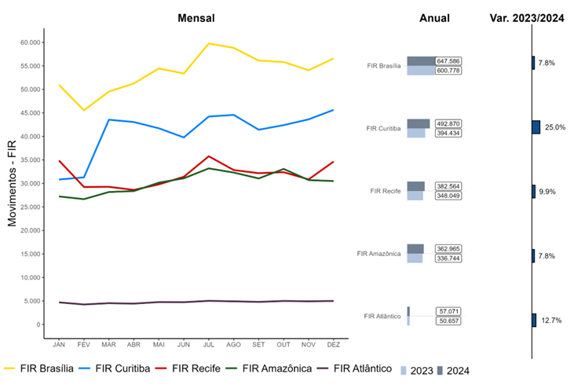
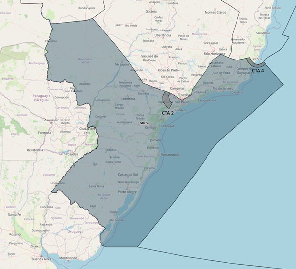
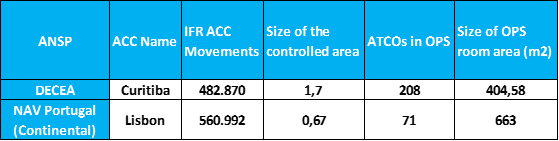

```{r}
#| label: setup
source(here::here("_chapter-setup.R"))
```

Throughout 2024, joint work between DECEA and EUROCONTROL involved the preparatory action for assessing the operational performance benefits of point-merge operations and comparing service provision within two units.
This chapter provides a first summary of the work to help refine the future work.

## Point-Merge Operations

Point Merge System (PMS) is an innovative air traffic sequencing technique designed to optimise aircraft arrival sequences, and enhance operational safety and workload. 
PMS operates efficiently under high traffic loads without the need for radar vectoring. 
It relies on a specific Precision-Area Navigation (P-RNAV) route structure, comprising a merge point and equidistant pre-defined sequencing legs. 
Traffic sequencing is achieved through a “direct-to” instruction to the merge point at the appropriate time. 
The sequencing legs are used to extend the flight path of an aircraft along the leg only when necessary. 
The length of these legs reflects the required delay absorption capacity, ensuring a streamlined and predictable arrival flow. 
<!-- is this in line with the first topic sentence? -->
This method simplifies controller tasks, reduces communication and workload, enhances pilot situational awareness, and improves the predictability and efficiency of flight trajectories. 
@fig-point-merge illustrates the Point Merge system and its components.

```{r}
#| label: fig-point-merge
#| fig.cap: Point-merge overview
#| out-width: 60%

```

The Point Merge System has been successfully implemented at various airports worldwide, demonstrating its effectiveness in enhancing airspace efficiency and reducing the environmental impact of fuel consumption. 
In Brazil, Guarulhos International Airport (SBGR) — one of the busiest hubs in Latin America — faces daily challenges related to high traffic density. 
To address these issues, PMS was implemented for arrival procedures at SBGR in May 2021. 
With a recent deployment in 2024, PMS was introduced at Lisbon Airport (LPPT).
The following is an illustration of flight trajectories at SBGR and LPPT during periods before and after the implementation of the Point Merge System (PMS).

```{r}
#| label: fig-pms-sbgr-2019-2024
#| fig-cap: Point-merge operations at Guarulhos (SBGR) (2019 vs 2024)
#| out-width: 70%

```

```{r}
#| layout-ncol: 2
#| fig-cap: 
#|   - "LPPT runway 02 - before point-merge"
#|   - "- post point-merge deployment"
#|   - "LPPT runway 20 - before point-merge"
#|   - "- post point-merge deployment"
#| out-width: 100%   





```

Monitoring Additional Time in TMA is valuable for assessing the impact of the Point Merge System (PMS) implementation on airspace operational performance. This indicator reflects the extra time an aircraft spends in the TMA compared to an ideal flight profile. A comparison of KPI08 values was conducted for periods before and after the implementation of PMS. For SBGR, the analysis covered the years 2019 (pre-PMS) and 2024 (post-PMS). These periods were chosen to avoid analytical bias, since PMS implementation at Guarulhos took place during the COVID-19 pandemic. The analysis period for LPPT spanned from March 2023 to July 2024. The following graph presents the results obtained. Reference times and additional times were calculated on a monthly basis.

<!--

[] convert figures to study data set - ASMA
[] include runway throughput ~ peak arrival rate ~ consistency during peak hours

------------------------------------------------- -->
<!--  # snapshot from study -->
<!-- # ASMA based on study data / algorithm 
lppt_asma <- readr::read_csv("./data/EUR-ASMA-LPPT.csv")

summer_asma_100 <- lppt_asma |> 
  mutate(YEAR = year(DATE), MONTH = month(DATE)) |> 
  filter(MONTH %in% c(3:7)) |> 
  group_by(ICAO, PHASE, YEAR, MONTH) |> 
  reframe(across(.cols = ARRS100:TOT_A100, .fns = ~ sum(.x))) |> 
  mutate(AVG_ADD_TIME = ADD100 / ARRS100, AVG_A100 = TOT_A100 / ARRS100) |> 
  pivot_longer(cols = contains("AVG"), names_to = "TYPE", values_to = "AVG_TIME") 

summer_asma_100 |> mutate(TIK = paste0(MONTH,"-",YEAR) ) |> 
  ggplot() + geom_col(aes(x = TIK, y = AVG_TIME, fill = TYPE))
-----------------------------------------------------------------    -->

```{r}
#| label: fig-lppt-asma-monthly
#| fig-cap: Monthly evolution of the additional time in terminal airspace in LPPT

lppt_study <- read_csv2("./data/LPPT-study-data.csv", show_col_types = FALSE) |> 
  mutate( RWY = case_when(RWY == "2" ~ "02", .default = RWY)
         ,RWY = paste("RWY", RWY)  
         ,MONTH_NUM = match(MONTH, month.abb)
         ,YM = paste0(YEAR,"-", MONTH_NUM)
         )

lppt_study |> mutate(YEAR = as.character(YEAR)) |> 
  
  ggplot() + 
  geom_col(aes(x = MONTH_NUM, y = ADD_TIME, fill = YEAR)
           , position = position_dodge2()) + 
  scale_x_continuous(breaks = 3:8, labels = month.abb[3:8]) +
  scale_y_continuous(limits = c(0,6)) +
  facet_wrap(.~RWY) +
  labs( x = element_blank(), y = "additional ASMA time [min/arr]"
       ,fill = element_blank()) +
  theme( legend.position = "inside", legend.position.inside = c(0.9, 0.95)
        ,legend.direction = "horizontal"
        ,legend.key.size = unit(3, "mm")
        )
```


```{r}
#| label: fig-sbgr-asma-monthly
#| fig-cap: Monthly evolution of the additional time in terminal airspace in SBGR

# load the data
sbgr_2019 <- read_csv("./data/BRA-ASMA-SBGR-2019.csv", show_col_types = FALSE)

sbgr_2019 <- sbgr_2019 |> 
  rename(AIRPORT = ADES, DATE = MOF, FLTS = N_VALID, TOT_A100 = SUM_TRAVEL
         , TOT_REF = SUM_REF, TOT_ADD = SUM_ADD_TIME, AVG_ADD = AVG_ADD_TIME) |> 
  mutate(YEAR = 2019 |> as.character()) 

sbgr_2024  <- read_csv("./data/BRA-ASMA.csv", show_col_types = F) |> 
  mutate(YEAR = substr(DATE, 1, 4)) |> 
  filter(AIRPORT == "SBGR", YEAR == 2024)

sbgr_comb <- sbgr_2024 |> 
  bind_rows(sbgr_2019) |> 
  mutate(X = substr(DATE, 6,7) |> as.numeric())
  
sbgr_comb |> 
  ggplot() + 
  geom_col(aes(x = X, y = AVG_ADD, fill = YEAR), position = position_dodge()) +
  scale_x_continuous(breaks = 1:12, labels = month.abb) +
  scale_y_continuous(limits = c(0,6)) +
  labs( x = element_blank(), y = "additional ASMA time [min/arr]"
       ,fill = element_blank()) +
  theme(legend.position = "inside", legend.position.inside = c(0.9, 0.95)
        ,legend.direction = "horizontal"
         ,legend.key.size = unit(3, "mm"))
```

The results presented in @fig-lppt-asma-monthly indicate an increase in additional time in the arrival airspace at LPPT. 
The additional time is shown for the period following the deployment of the point merge operations covering March through August focussing on the last 40NM around Lisbon.
The results are also broken out to showcase the behaviour for both landing directions at Lisbonm, i.e., runway 02 and runway 20.
For both runways, an increase in the additional time can be observed. Aside the results for March that represents the transition to point merge operations, the observed additional time increased on average by about a minute when compared to the pre-deployment year 2023.
It must be noted that the results for LPPT are point-in-time snapshots and influenced by the start of operations. 
There might be additional flow control measures in place to support the transition, including additional buffers or alignment patterns. 
Future work could explore how the actual arrival routes changed based on the newly arrival management technique.

The operations at SBGR show a clear trend when comparing pre-pandemic traffic levels to the current arrival flows, c.f. @fig-sbgr-asma-monthly.
A mild seasonal pattern is observable, with the monthly average additional time in terminal airspace ranging post the point-merge implementation lower than in 2019.
With the summer months a more varied behaviour is observed seen a fluctuation of the obsered additional times. 

For the implementation of the PMS, the following observations can be made. 
Operationally, the PMS enabled a higher occupancy rate within the terminal airspace. 
By design, the PMS enhances the terminal's capacity to manage and organise inbound traffic more efficiently. 
However, the runway throughput remained unchanged, as increasing runway capacity would require physical infrastructure modifications or change of the operational concept (i.e., separation minima). 
Consequently, although the terminal airspace can now accommodate a greater number of approaches simultaneously, the airport’s ground infrastructure cannot absorb this increased demand at the same pace. This mismatch leads to longer dwell times within the terminal area as aircraft await clearance to land.

## Air Traffic Services at Curitiba and Lisbon Continental

### Overview Curitiba ACC

The Curitiba Area Control Center (ACC-CW) is one of four Area Control Centers strategically distributed across Brazil. 
Located in the city of Curitiba, in the state of Paraná, ACC-CW plays a crucial role in controlling the airspace of the southern region of the country, ensuring safe and efficient operations for both civil and military aircraft.

ACC-CW's jurisdiction covers the entire portion of the Curitiba Flight Information Region (FIR-CW), excluding the airspace delegated to the South-east Regional Airspace Control Center (CRCEA-SE). This jurisdiction totals approximately 1.7 million km², representing 7.7% of the airspace delegated to Brazil. Within this airspace, the Air Traffic Control Service, Flight Information Service, and Alert Service are provided.

The Air Traffic Control Service is provided to all aircraft flying above FL 150. Additionally, this service is exclusively provided to aircraft flying above FL 120 in CTA 2 (departures and arrivals for Viracopos Airport in Campinas-SP) and CTA 4 (departures and arrivals for Vitória Airport in Espírito Santo).

In 2024, traffic within FIR-CW exceeded 492,000 flights, representing a 25% increase compared to 2023 (394,000 flights). Notably, 11 of the 30 busiest aerodromes in Brazil in 2024 are located within FIR-CW (c.f. @fig-bra-acc-tfc).

```{r}
#| label: fig-bra-acc-tfc
#| fig-cap: Traffic figures for Brazilian ACCs
#| out-width: 80%

#
tfc <-  readxl::read_excel("./data/ACC-CTB-MOV.xlsx") |> 
  dplyr::rename(YEAR = Month) |> 
  tidyr::drop_na() |> tidyr::pivot_longer(cols = Jan:Dec, names_to = "MONTH") |>
  dplyr::mutate(DATE = paste0(YEAR,"-", MONTH, "-01") |> lubridate::ymd())

tfc |> ggplot() + 
  geom_path(aes(x = DATE, y = value, group = ACC, color = ACC)) + 
  scale_y_continuous(limits = c(0,NA)) +
  labs(x = element_blank(), y = "monthly traffic")
```

The FIR-CW encompasses the Terminal Control Areas (TMA) of São Paulo, Rio de Janeiro, Curitiba, Florianópolis, Porto Alegre, Foz do Iguaçu, Campo Grande, Santa Maria, Macaé, Londrina, and Presidente Prudente.
One of the objectives of the cooperation agreement established between DECEA and MUAC—the Rostering Philosophies and Tools Agreement—is to support the implementation of the TOTAL ATM philosophy.
ACC-CW was selected to be the first operational unit in Brazil to implement changes related to new philosophies and methodologies for operational staff rostering. It was also chosen to develop and implement, with the support of MUAC, the Air Traffic Support System for the Use of Human Resources in Operational Needs, known as SATURNO.

The implementation of SATURNO began in March 2025 and is being carried out in phases, with completion expected by the end of the year.
To improve planning for operational position configurations and the allocation of air traffic controllers during shifts, the ACC-CW airspace, currently, is divided into 18 sectors and two regions: North and South.

```{r}
#| label: fig-ctb-northsouth
#| fig-cap: ACC-CW area of responsibility
#| out-width: 80%


``` 

### Center-level comparision Curitiba ACC and Lisbon Continental

```{r}
#| label: fig-HLC-Curitiba-Lisbon
#| fig-cap: High-level comparison ACC Curitiba and Lisbon
#| out-width: 98%


``` 

In light of this report @fig-HLC-Curitiba-Lisbon provides an initial side-by-side comparison between DECEA and NAV Portugal (Continental) regarding selected operational characteristics of their Area Control Centers (ACCs). 
While each organisation operates within its own regional and structural context, some key characteristics are worth highlighting.

Despite operating within a smaller controlled airspace, NAV Portugal managed a higher volume of IFR ACC movements than DECEA during the same period while handling nearly 25% fewer flight hours. 
This points to a denser and more concentrated traffic environment, likely driven by Portugal’s geographical location within Europe and the structure of its flight corridors.

Another relevant aspect is the number of air traffic controllers (ATCOs) assigned to the operations room. 
NAV Portugal handles its operational workload in a larger OPS room with only 71 ATCOs, highlighting distinct differences in operational concepts, levels of automation, and staffing philosophies between the two organizations.

In terms of sector configuration, Curitiba operated up to 13 sectors at the end of 2024, compared to a maximum of 9 sectors in Portugal. 
For the year as a whole, the total number of sector hours was similar, with Portugal recording approximately 2,000 more hours.

This characterisation underscores the importance of accounting for regional characteristics and operational context when interpreting air navigation service metrics or designing systems such as staffing models or control room layouts.
It will be interesting to expand this initial topic study by addressing the traffic characteristics on the basis of trajectory, flow and sequencing measures applied to handle the traffic within the respective areas of responsibility.
This will support a refined assessment of the performance benefits from the implemented concept of operations.

## Summary

This chapter highlighted two topics of interest for both parties. 
It offers a first insight into operational concepts, their implementation, and observed performance benefits.

Point merge is a sequencing technique that gained higher visibility over the past years.
This initial comparison comprises a snapshot at the system deployed at SBGR and - a recent implementation at - LPPT.

Both groups are interested in advancing the state-of-the-art in assessing network- and center-level aspects. 
To move towards a more granular comparison, this report showcases two broadly comparable air traffic service units in Brazil and Europe. 
The comparison allowed for a high-level comparison on a set of harmonised indicators suitable to describe the scope of the service provision. 
This was useful to characterise the similarities and differences between both units. 
Future work will revolve around addressing the operational aspects within the respective areas of responsibility and deployed operational flow and sequencing concepts.

