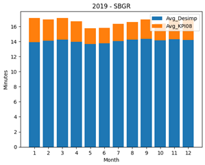
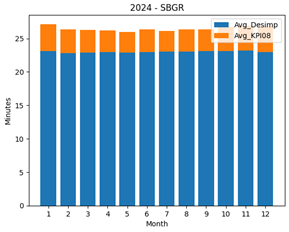
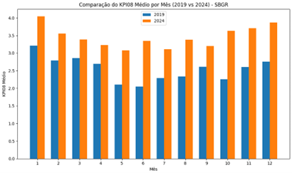
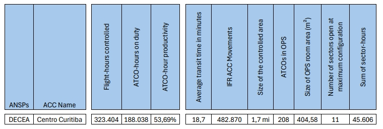

```{r}
#| label: setup
source(here::here("_chapter-setup.R"))
```

Throughout 2024, joint work between DECEA and EUROCONTROL involved the preparatory action for assessing the operational performance benefits of point-merge operations and comparing service provision within two units.
This chapter provides a first summary of the work to help refine the future work.

## Point-Merge Operations

Point Merge System (PMS) is an innovative air traffic sequencing technique designed to optimise aircraft arrival sequences, reduce flight times (???), and enhance operational safety. 
PMS operates efficiently under high traffic loads without the need for radar vectoring. 
It relies on a specific Precision-Area Navigation (P-RNAV) route structure, comprising a merge point and equidistant pre-defined sequencing legs. 
Traffic sequencing is achieved through a “direct-to” instruction to the merge point at the appropriate time. 
The sequencing legs are used to extend the flight path of an aircraft along the leg only when necessary. 
The length of these legs reflects the required delay absorption capacity, ensuring a streamlined and predictable arrival flow. 
<!-- is this in line with the first topic sentence? -->
This method simplifies controller tasks, reduces communication and workload, enhances pilot situational awareness, and improves the predictability and efficiency of flight trajectories. 
@fig-point-merge illustrates the Point Merge system and its components.

```{r}
#| label: fig-point-merge
#| fig.cap: Point-merge overview
#| 
knitr::include_graphics("./figures/Point Merge Structure.png")
```

The Point Merge System has been successfully implemented at various airports worldwide, demonstrating its effectiveness in enhancing airspace efficiency and reducing the environmental impact of fuel consumption. 
In Brazil, Guarulhos International Airport (SBGR) — one of the busiest hubs in Latin America — faces daily challenges related to high traffic density. 
To address these issues, PMS was implemented for arrival procedures at SBGR in May 2021. 
With a recent deployment in 2024, PMS was introduced at Lisbon Airport (LPPT).
The following is an illustration of flight trajectories at SBGR and LPPT during periods before and after the implementation of the Point Merge System (PMS).

```{r}
#| label: fig-pms-sbgr-2019-2024
#| fig-cap: Point-merge operations at Guarulhos (SBGR) (2019 vs 2024)
#| out-width: 70%
knitr::include_graphics("./figures/trajectory 2019_2024_SBGR.png")
```

```{r}
#| layout-ncol: 2
#| fig-cap: 
#|   - "LPPT runway 02 - before point-merge"
#|   - "- post point-merge deployment"
#|   - "LPPT runway 20 - before point-merge"
#|   - "- post point-merge deployment"
#| out-width: 100%   

knitr::include_graphics("./figures/beforePMS_rwy02.png")
knitr::include_graphics("./figures/afterPMS_rwy02.png")
knitr::include_graphics("./figures/beforePMS_rwy20.png")
knitr::include_graphics("./figures/afterPMS_rwy20.png")
```

Monitoring Additional Time in TMA is valuable for assessing the impact of the Point Merge System (PMS) implementation on airspace operational performance. This indicator reflects the extra time an aircraft spends in the TMA compared to an ideal flight profile. A comparison of KPI08 values was conducted for periods before and after the implementation of PMS. For SBGR, the analysis covered the years 2019 (pre-PMS) and 2024 (post-PMS). These periods were chosen to avoid analytical bias, since PMS implementation at Guarulhos took place during the COVID-19 pandemic. The analysis period for LPPT spanned from March 2023 to July 2024. The following graph presents the results obtained. Reference times and additional times were calculated on a monthly basis.

:::{.callout-note}

[] convert figures to study data set --> ASMA
[] include runway throughput ~ peak arrival rate ~ consistency during peak hours

:::


```{r}
lppt_asma <- readr::read_csv("./data/EUR-ASMA-LPPT.csv")

summer_asma_100 <- lppt_asma |> 
  mutate(YEAR = year(DATE), MONTH = month(DATE)) |> 
  filter(MONTH %in% c(3:7)) |> 
  group_by(ICAO, PHASE, YEAR, MONTH) |> 
  reframe(across(.cols = ARRS100:TOT_A100, .fns = ~ sum(.x))) |> 
  mutate(AVG_ADD_TIME = ADD100 / ARRS100, AVG_A100 = TOT_A100 / ARRS100) |> 
  pivot_longer(cols = contains("AVG"), names_to = "TYPE", values_to = "AVG_TIME") 

summer_asma_100 |> mutate(TIK = paste0(MONTH,"-",YEAR) ) |> 
  ggplot() + geom_col(aes(x = TIK, y = AVG_TIME, fill = TYPE))
```






 


The results indicated an increase in additional time for both airports following the implementation of the PMS. This suggests that, operationally, the PMS enabled a higher occupancy rate within the TMA. By design, the PMS enhances the terminal's capacity to manage and organize inbound traffic more efficiently. However, the runway throughput remained unchanged, as increasing runway capacity would require physical infrastructure modifications. Consequently, although the terminal airspace can now accommodate a greater number of approaches simultaneously, the airport’s ground infrastructure cannot absorb this increased demand at the same pace. This mismatch leads to longer dwell times within the terminal area as aircraft await clearance to land.

**References**

Eurocontrol. (2014). Point Merge: Integration of Arrival Flows Enabling Extensive RNAV Application and Continuous Descent. Eurocontrol Experimental Centre.

FRANZINI, Bruno Monteiro et al. (2024). Analysis of Guarulhos Point Merge Adherence Based On Additional Time In Tma And Trajectory Clustering.. In: Anais do XXI Simpósio de Transporte Aéreo - SITRAER 2024.

ICAO. (2016). Continuous Descent Operations (CDO) Manual. International Civil Aviation Organization.


## Air Traffic Services at Curitiba and Lisbon Continental

The Curitiba Area Control Center (ACC-CW) is one of four Area Control Centers strategically distributed across Brazil. 
Located in the city of Curitiba, in the state of Paraná, ACC-CW plays a crucial role in controlling the airspace of the southern region of the country, ensuring safe and efficient operations for both civil and military aircraft.

ACC-CW's jurisdiction covers the entire portion of the Curitiba Flight Information Region (FIR-CW), excluding the airspace delegated to the Southeast Regional Airspace Control Center (CRCEA-SE). This jurisdiction totals approximately 1.7 million km², representing 7.7% of the airspace delegated to Brazil. Within this airspace, the Air Traffic Control Service, Flight Information Service, and Alert Service are provided.

The Air Traffic Control Service is provided to all aircraft flying above FL 150. Additionally, this service is exclusively provided to aircraft flying above FL 120 in CTA 2 (departures and arrivals for Viracopos Airport in Campinas-SP) and CTA 4 (departures and arrivals for Vitória Airport in Espírito Santo).

In 2024, traffic within FIR-CW exceeded 492,000 flights, representing a 25% increase compared to 2023 (394,000 flights). Notably, 11 of the 30 busiest aerodromes in Brazil in 2024 are located within FIR-CW.


The FIR-CW encompasses the Terminal Control Areas (TMA) of São Paulo, Rio de Janeiro, Curitiba, Florianópolis, Porto Alegre, Foz do Iguaçu, Campo Grande, Santa Maria, Macaé, Londrina, and Presidente Prudente.

Currently, ACC-CW is divided into 18 sectors and two regions: North and South.

Comparison with EUROCONTROL



**Flight-hours controlled:\
** The total number of controlled flight hours was calculated for the year 2023.

**ATCO-hours on duty:\
** The total monthly scheduled hours of operators in the year 2024 were summed, considering the operational positions: Controller, Control Assistant, Coordinator, and Supervisor.

**Average transit time in minutes:\
** The average transit time in minutes was calculated per
sector for the year 2023, as it provides a complete annual sample

**ATCOs in OPS:\
** The number of ATCOs in operation was calculated based on the monthly average of qualified operators at ACC-CW, as recorded in SGPO. Currently, ACC-CW has 2,013 operators and 10 trainees.
