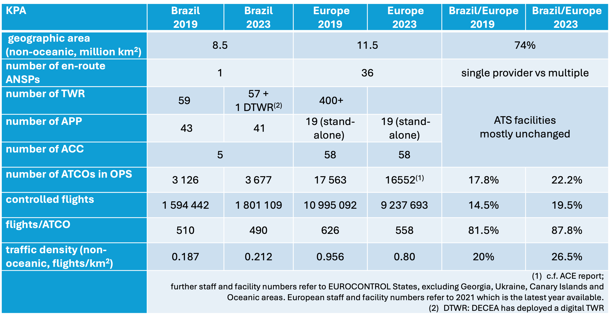

this is the placeholder for PM



@fig-hlc-table-demo is a great example of how the 2 regions compare.

```{r}
#| label: fig-hlc-table-demo
#| fig-cap: This is our hlc table
#| out-width: 50%

```

